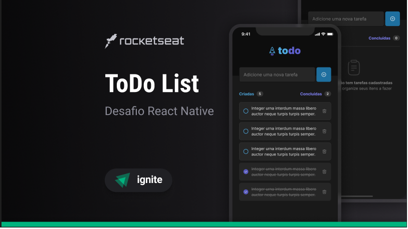

<h1 align="center">
  
</h1>

  
  

## 💻 Projeto

A aplicação **Todo** foi desenvolvida para ajudar você a gerenciar suas tarefas diárias de maneira simples e eficiente. Adicione, visualize e remova tarefas com facilidade, mantendo-se organizado e produtivo.

## ✨ Tecnologias

Esse projeto foi desenvolvido com as seguintes tecnologias e ferramentas:

-   [ ] **React Native** - Biblioteca JavaScript para criar interfaces nativas.
-   [ ] **TypeScript** - Superset de JavaScript que adiciona tipagem estática.
-   [ ] **Expo** - Plataforma que facilita o desenvolvimento com React Native.
-   [ ] **Context API** - Gerenciamento de estado global simplificado.
-   [ ] **Async Storage** - Armazenamento persistente para salvar as tarefas localmente.
-   [ ] **Vector Icons** - Biblioteca para usar ícones vetoriais na aplicação.
-   [ ] **Styled Components** - Biblioteca para escrever estilos CSS em JavaScript.
-   [ ] **React Native Gesture Handler** - Manipulação de gestos e interações na aplicação.

## :hammer_and_wrench: Features

-   [ ] Sincronizar com Amazon-Alexa.
-   [ ] Vizualizar todas tarefas concluidas (excluidas).
-   [ ] Criar notificações de push.
-   [ ] Botão para alterar cor de fundo.

## ✨ More :p -
   
  

  
  
  
  
  
  
  
  

